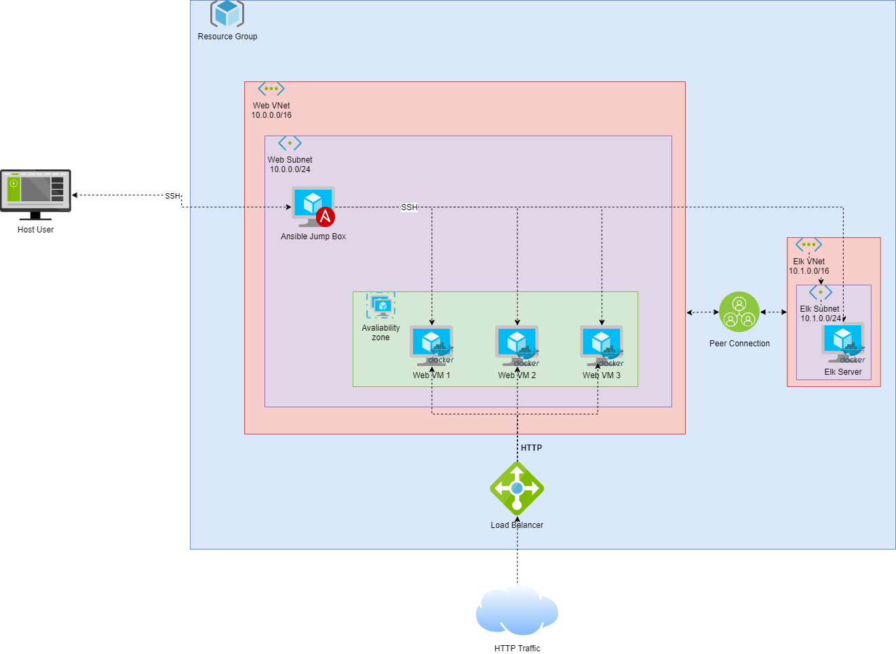
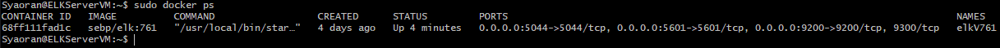
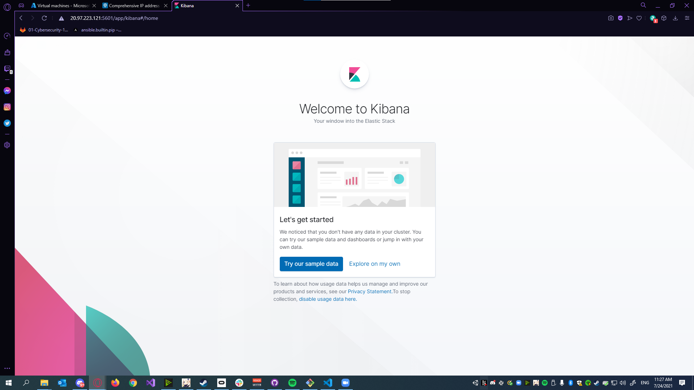
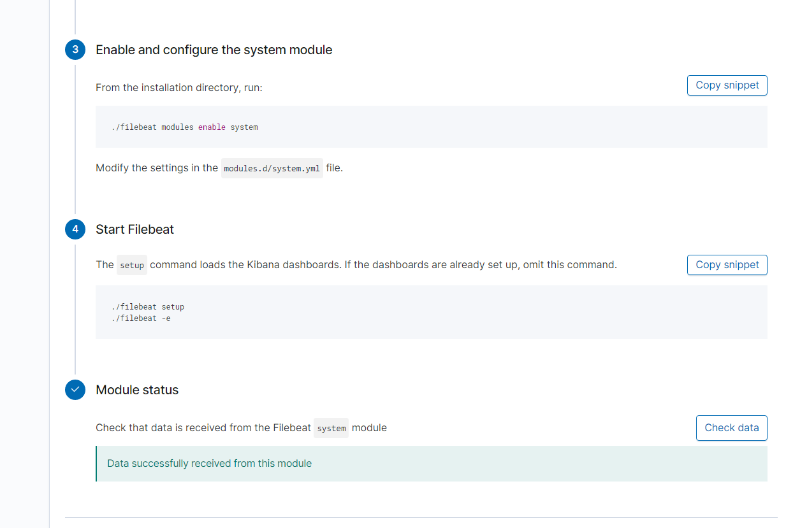

## Automated ELK Stack Deployment

The files in this repository were used to configure the network depited below

These files have been tested and used to generate a live ELK deployment on Azure. They can be used to either recreate the entire deployment pictured above. 

This document contains the following details:
- Description of the Topology
- Access Policies
- ELK Configuration
  - Beats in Use
  - Machines Being Monitored
- How to Use the Ansible Build

### Description of the Topology

The main purpose of this network is to expose a load-balanced and monitored instance of DVWA, the D*mn Vulnerable Web Application.

Load balancing ensures that the application will be highly available, in addition to restricting traffic to the network.

While Filebeat watches log files or locations we may want to monitor, while Metricbeat takes the statistics and metrics and sends them over to Elasticsearch.

The Configuration details of each machine used are below.

| Name     | Function   | IP Addr  | OS    | Container |
|----------|------------|----------|-------|-----------|
| Jump Box | Gateway    | 10.0.0.4 | Linux | Ansible   |
| Web-1    | Web Server | 10.0.0.7 | Linux | DVWA      |
| Web-2    | Web Server | 10.0.0.8 | Linux | DVWA      |
| Web-3    | Web Server | 10.0.0.9 | Linux | DVWA      |
| Elk-Host | Elk Server | 10.1.0.4 | Linux | Elk:761   |

### Access Policies

The machines on the internal network are not exposed to the public Internet. 

Only the Jump Box and Elk-Host machine can accept connections from the Internet. Access to these machines is only allowed from my Personal IP Address, Which has been configured in the selected Network Security groups. Jump Box via SSH on Port 22, and Elk-Host via Web-browser on port 5601. The Web Servers can be hit from the Load Balancers IP and the traffice goes through Port 80.

All other Machines within the network can only be accessed by the Jump Box VM, via an SSH connection. 

| Name     | Publically Accessible | Allowed Addresses    |
|----------|-----------------------|----------------------|
| Jump Box | No                    | Private IP Port 22   |
| Elk-Host | No                    | Private IP Port 5601 |
| Web-1    | Yes                   | All via Port 80      |
| Web-2    | Yes                   | All via Port 80      |
| Web-3    | Yes                   | All via Port 80      |

### Elk Configuration

Ansible was used to automate configuration of the ELK machine. No configuration was performed manually, which is advantageous because in the case of deploying multiple applications everything stays uniformed with the same configuration. If you needed to deploy another machine to do the same thing its already automated and tested so you can easily just run the script and deploy the new VM in minutes.

The `Elkbook.yml` playbook implements the following tasks:
 - Changes a `systemctl` file to allow the container to access more memory. 
 - Installs Docker.io
 - Installs Python3 Pip
 - Installs Pip Docker Module
 - Installs the Elk Container to Listen on a series of Ports and ensure that it starts up with Docker Service
 - Ensures Docker Service Starts on Boot

The following screenshot displays the result of running `docker ps` after successfully configuring the ELK instance on the Elk-Host Machine.

### Target Machines & Beats
This ELK server is configured to monitor the following machines:
 - 10.0.0.7
 - 10.0.0.8
 - 10.0.0.9

We have installed the following Beats on these machines:
 - Filebeat
 - Metricbeat

These Beats allow us to collect the following information from each machine:
 - The Filebeat module collects and parses logs created by the system logging service of common Unix/Linux based distributions.
 - The Metricbeat we used the Docker module, which fetches metrics from the docker server. 

### Using the Playbook
In order to use the playbook, you will need to have an Ansible control node already configured. Assuming you have such a control node provisioned: 

SSH into the control node and follow the steps below:
 - Copy the  file to your ansible container.
 - Update the `hosts` file to include the servers you are wanting to update. (In this case we are using the Elk deployment file. So you would want to add an elk host catagory, and the Ip)
 - Run the playbook with `ansible-playbook ElkBook.yml`, then navigate to your Elk-Host's Public IP on Port 5601. `http://[your.ELK-VM.External.IP]:5601` You should see something similar to the screenshot below

From here you can Install Metricbeat or Filebeat: 
 - Back to your Ansible Container, Make sure you copy  to your ansible container. 
 - Make sure your `hosts` file has the Web -VMs IP's under the WebServers section. (Ensure that webservers is uncommented.)
 - Run the playbook with `ansible-playbook InstallFilebeat.yml`
 - Navigate to `http://[your.ELK-VM.External.IP]:5601` > Click Add Log Data > System Logs > Scroll down to `Module Status` and Click `Check Data` it should return with the Screenshot below 
 

### Extra 
AWS Amazon Linux is special, Added Files for deploying the same setup, but with Amazon Linux OS. Check `README.md` Located in the `AWS_Extra` Folder. 
 - Added AWS YML script to deploy DVWA WebServers on AWS Amazon Linux
 - Added AWS YML Script to deploy Elk Server on AWS Amazon Linux